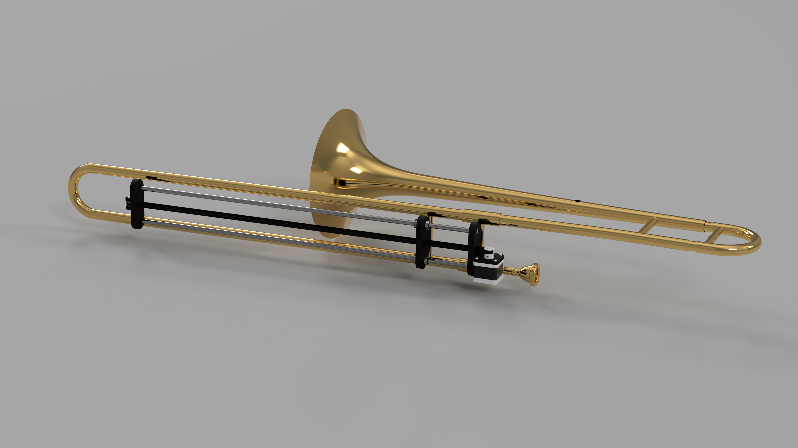
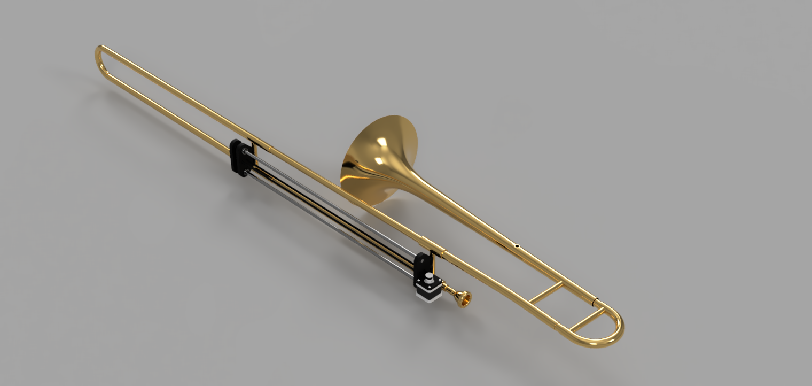
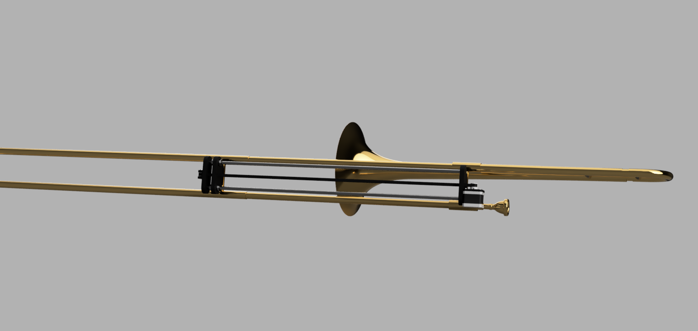
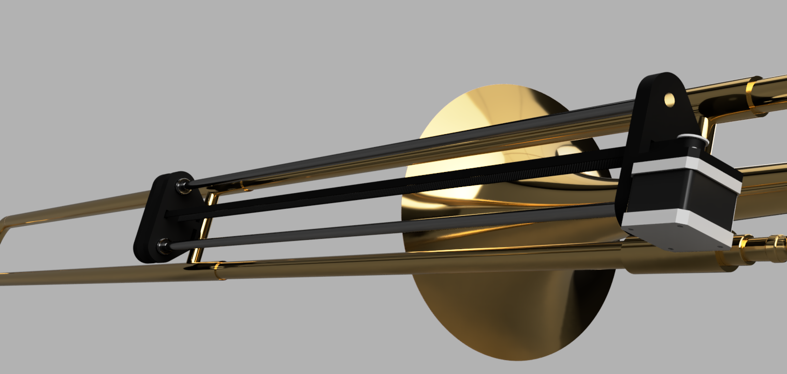

# Automatic Linear Trombone Drive
 Still a Prototype that has yet to be built or source a trombone

If you would like to have a live 3D view

    https://a360.co/3wibCaY

    Password: HP024 

## Images

## Credit:
**Model by: Hayden Threlfall**

Trombone from GrabCad

https://grabcad.com/library/copper-trombone-1

By: Lucas Lac124 (Lucas Lacerda)

Some Surface Appearances applied by: Grace Harding